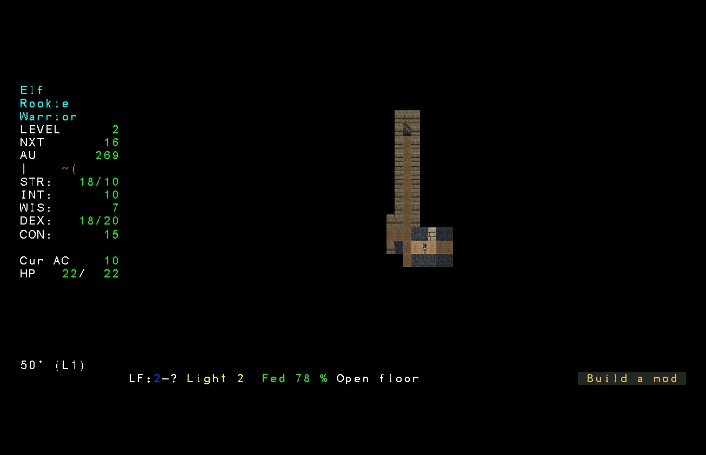

# neo-angband-mod-borg

Borg (Angband's automatic player) for
[Neo Angband](https://github.com/neostryder/neo-angband), as a mod.

**Needs Neo Angband 0.27.0 or newer.** An older game refuses to load it and says
so; the blockquote below says why that is a refusal rather than a reduced Borg.

Install it from the game's **Install a mod...** row. Enabling the mod does **not**
hand it your character: press **Ctrl-Z** in play to warn, confirm, and hand over
the keyboard. Press Ctrl-Z again (or any other real key) to take it back.

## What it is

A faithful port of Angband 4.2.6's `borg/`: the same priority ladder, the same
danger model, the same power scoring, by the original's rules rather than by a
fresh set of heuristics that merely look similar.

> ### What is ported and what is CONNECTED are not the same thing
>
> Measured 2026-08-21, stated here rather than left for you to find. All of the
> above is true of the code in `src/`. Whether it is true of the mod you install
> depends on `plugin.ts`, which builds the Borg from host-supplied resolvers -
> and for a long time most of those did not exist.
>
> All four resolver seams are now wired: danger vision, activation identity,
> the in-shop signal, and the power of a hypothetical loadout. The plugin reads
> the game's bound registries from `ctx.registries` and the live state from
> `ctx.state`, and builds real resolvers from them: `borg_danger` runs on actual
> blows, spell frequencies and race flags rather than on zeroes, the Borg can tell
> whether a worn item grants the activation it wants and whether it is charged, it
> knows which shop it is standing in, and it can score gear it is not wearing - so
> it wears what it finds, buys what it needs and sells what it is finished with
> instead of hoarding. A mod's monsters and items are covered on exactly the
> same terms as core's: every registry is bound after mods compose their
> content, and each resolver reads it by index (`ridx`, `tval`/`sval`, ego and
> artifact name) without consulting provenance, so content a mod added is treated
> identically to core's.
>
> It starts a new character when it dies, and that is the engine's own work
> rather than this mod's: a controller can only return an in-game command, so it
> has nothing to say that means "roll me a new character". The game's death
> handler does it, whenever a mod holds the keyboard. It is an in-session
> reincarnation and not a new save - same session, same slot, a rolled race and
> class each time, exactly as upstream's borg respawns.
>
> Those last two arrived in Neo Angband 0.25.0, and that is why this version
> requires it rather than degrading on an older game. Earlier versions declared
> `>=0.12.0` and fell back: on a game without the loadout derive the Borg wore
> nothing it found, bought nothing it needed and sold nothing it was done with,
> and on a game without the death handler a death simply ended the run. Between
> them that is not a Borg with a feature missing, it is a Borg that cannot do the
> two things the word means. Nothing was preserved by loading anyway, either: no
> earlier version of this mod ran a working autoplayer on any engine, so there is
> no installation the floor could take away from.
>
> The three stalls that stopped it playing are fixed, and there is now a test
> that plays. Watched in the released 0.25.0 desktop build on 2026-08-21, over
> two characters, it took the keyboard, shopped, wore what it bought, found the
> town's down staircase and descended - and then stalled on the first dungeon
> level both times without dying. Five separate causes came out of that, four of
> them one-line facts:
>
> - a locked door arrived as a trap to disarm, and `disarm` refuses one for free;
> - nothing in the port ever used a staircase it was standing on;
> - a readiness flag was initialised to "never asked" and never asked;
> - arriving on a level did not clear "use the next staircase", so town and level
>   one became a shuttle;
> - and a hypothetical loadout's score was compared against a live one derived a
>   different way, which in a daytime town differed by 14000 points, made every
>   wearable item an upgrade, and turned two identical torches into an endless
>   swap.
>
> Four of those are in this repository. The first is in the game's, as is the
> sixth: an autoplayer used to park on every prompt that blocks for a keypress, so
> going downstairs needed a human. `src/play.test.ts`
> is the instrument that found the last four and now guards all five: it boots a
> real game, hands it to the Borg, and drives 1500 decisions per seed, checking
> that no single command ran away with the session and that the character covered
> ground. Over four seeds it now explores hundreds of squares, opens doors,
> disarms real traps, changes level under its own steam, and dies - which is the
> ending upstream's borg reaches too, and the half the restart loop needs.
>
> Then it was watched again, and it lost a fight it should have won. A
> level-one character stood still in town while something it could not see killed
> it. That was not a bad decision on good information: it was six more values the
> ported decision code reads and nothing in this mod ever wrote. Upstream's whole
> answer to an attacker it cannot find is regional fear, and this port had the
> caches, the two functions that fill them and every reader that consults them,
> with nothing in between. Alongside it: the seam carrying "is it safe to rest
> here" was the constant `true`; none of the durations the Borg tracks were ever
> decremented, so each latched on first use; and the table that tells the
> self-model which object is a Ration of Food defaulted to empty, so a full pack
> counted as no food, no cures, no phase doors and no fuel. All six are closed.
>
> The "sitting there or moving frantically back and forth across three cells" half
> of that report had two causes. One was the staircase shuttle above, watched on
> the version before it was fixed. The other was a phantom: nothing in the port
> ever revised a monster record downward, so a monster that died out of sight or
> walked away stayed on the Borg's map for two thousand turns and the Borg kept
> walking to where it used to be. Measured over four seeds and 2000 decisions
> each, the number of sixty-decision stretches spent inside three squares with
> nothing in sight and nothing to heal went from 403 to zero, and the ground
> covered nearly doubled.
>
> Then it was watched playing, and this time it played. 2026-08-22, thirteen
> minutes in the development build and four in the packaged 0.26.0 artifact, each
> on its own isolated data directory: no mod faults, no console errors, 37 blocking
> prompts answered without a human, four locked doors picked a turn at a time, four
> secret doors found by searching, thirteen monsters killed in the artifact run, and
> four characters that died and started again on their own. It fled twice under a
> low-hitpoint warning by taking the stairs, arrived in town at 6 of 11 hit points,
> and rested back to 10 before diving again.
>
> The shopping mechanism itself is proven, end to end. Borg can identify its
> current shop, evaluate purchases and sales, and issue `shop-buy`, `shop-sell`
> and `shop-exit` through the engine's command registry. Placed by hand on a real
> shop door across ten seeds, it sold something with a real inventory change on
> all ten and bought something with gold actually decreasing on three of ten.
> What has not been observed is a Borg *walking itself* to a shop during real
> play: in every seed tried, a fresh level-one character heads straight to the
> dungeon stairs before the "deal with shops" decision is ever reached, so the
> town returns above are upstream's own cautious level-one behaviour, not the
> ladder choosing to shop.
>
> So: install it to watch it try, not to watch it win. And do not take the rest of
> the suite for evidence - most of the other files cover dispatch, ladder ordering
> and resolver wiring, and they do not play a turn. That was exactly the gap;
> `play.test.ts` is the answer to it, and `rest.test.ts` pins the path that death
> went through.

It is a **mod**, not part of the engine, and that division is decided rather than
incidental:

- It is not core. Putting an automatic player inside the parity target would
  put an AI control surface inside the thing being kept faithful to Angband 4.2.6.
  Upstream's borg is a compile-time option precisely because it is not the game.
- It reaches the game through a published API, the same one any third-party
  automation would use: perceive through a read-only view of the game state, act
  through the command queue. No private path, no test hook. If the borg could only
  be written against internals, then the modding API would not be finished, and
  that is worth finding out.

That second point is the real reason it is worth having: it is the most demanding
mod anyone could write against this API, so it is the best available test of
whether the API is honest. Two of the things found while wiring it up were engine
bugs rather than Borg bugs.

## Telling it how to play

Upstream's borg reads a `borg.txt` out of the user's Angband folder and takes
about thirty settings from it. There is no such folder here, and no path to one
on a phone, so those settings are toggles in the mod manager. Each one's
description names the `borg_` setting it is, so a `borg.txt` you already have
translates row by row. Handing over the keyboard itself is Ctrl-Z, not a toggle.

    Play risky                     borg_plays_risky
    Value melee and missile damage borg_worships_damage
    Value speed                    borg_worships_speed
    Value hit points               borg_worships_hp
    Value spell points             borg_worships_mana
    Value armour class             borg_worships_ac
    Value gold                     borg_worships_gold
    Save up for something it wants  borg_self_scum
    Skimp on stockpiles for an early munchkin run borg_munchkin_start

Every default is upstream's own, so leaving all of them alone gets the Borg
Angband ships. *Save up for something it wants* is the one that starts on,
because `borg_self_scum` does.

Play risky is the setting that changes the most. It skips the early hit-point
and character-level floors that hold the Borg above a depth, makes it wait longer
before drinking a cure, and makes it back away later in a losing fight. It gets
deeper faster and it dies more.

The five "Value" settings are how the Borg weighs a piece of gear, and they
stack: switching on two adds both weights. They are the closest thing here to
telling it what kind of character to be, because what a Borg wears is most of
what it becomes. There is no separate setting for stat priorities, and there is
none upstream either - `borg.txt` describes one in a comment, but no setting
backs it and the reincarnation code just takes the game's default point-buy.

Skimp on stockpiles for an early munchkin run moves how the Borg values
consumables at a low character level, on the assumption that a young character
is cashing out for gold rather than settling in. It does not make the Borg
stair-scum for loot the way `borg_munchkin_start` also does upstream - that
half needs a diving mode this port has not built.

A changed toggle takes effect on the next reload, the same as any other mod
setting. The log line the Borg writes when it takes the keyboard names every
setting that is not on its stock value, so the record of an unattended run says
what it was told to do.

Three of upstream's settings are deliberately absent rather than merely
unimplemented: `borg_kills_uniques` and `borg_uses_dynamic_calcs` each need a
subsystem this port does not have (a live census of which uniques are still
alive, and a whole second formula-driven calculation engine), and
`borg_uses_swaps` has a reader but nothing downstream of it - the swap items it
would value are not ported either, so the toggle would tick and the Borg would
play identically either way. The numeric settings - depth ceilings, the enchant
limit, a pinned race or class to respawn as - have no yes-or-no shape, and the
host's mod-manager toggle is boolean only, so there is no rule type to carry one
yet. See PLANNED.md for what each of these still needs.

Since Neo Angband 0.27.2 the mod manager also shows an **Autoplayer speed**
row while an autoplayer holds the keyboard, with Turbo/Fast/Normal/Slow tiers
(10/40/120/400 milliseconds a turn) as of 0.28.0. That control is the host's,
not this mod's: any mod that returns a controller gets the row for free, with
no manifest change here.

## Two things it does not do

- It cannot cheat. Upstream's borg reads the game's own structures directly
  (its comments call these "cheats") and scrapes the terminal for the rest. This
  one sees exactly what the perceive facade grants it, and acts only through
  commands a player could issue.
- It does not cost you reproducibility. Borg is deterministic: it draws
  only its own seeded generator and never the game's, so a Borg game stays
  replayable and the save's determinism ratchet stays untripped. An autoplayer that
  used a wall clock or a network would trip it, and would have to declare that in
  its manifest.

  It does mark the character, and that is a different thing. Handing the keyboard
  over sets the save's `NOSCORE_BORG` flag, which keeps the character off the
  high-score table and shows in its dump as an `[Autoplayed]` block. That is
  upstream's own behaviour and it is one-way: a character that has run the Borg
  for one turn carries the mark for the rest of its life. A game somebody watched
  is not a game somebody played.

Only one autoplayer can hold the keyboard at a time. If another agent mod already
has it, this one is refused by name rather than silently taking over.

## Layout

    manifest.json    what the game reads: id, engine range, capabilities, toggles
    plugin.js        the built artefact the game fetches and hashes; committed
    plugin.ts        the entry point: takes ctx.core, returns a controller
    src/             the port itself

`src/core-api.ts` is worth reading before anything else under `src/`: it is the
one place the Borg touches the engine at runtime, and its header explains the
single rule that arrangement imposes on every other file.

## Building and testing

    pnpm install --frozen-lockfile
    pnpm verify     # typecheck, test, and prove plugin.js is a current build

`plugin.js` is committed, because an install fetches it from a pinned tag and runs it
as it is; nothing rebuilds it on the way in. So a stale artefact passes every other
check and is the file players actually run. `pnpm check` is what stops that.

The suite runs the port **and** drives the built `plugin.js`, which is a different
artefact: the engine arrives through ESM live bindings, and whether those survive
bundling is a separate question from whether they work in TypeScript.

To develop against an unreleased engine:

    NEO_ANGBAND_LOCAL_CORE=1 pnpm test

## Releasing

A tag matching `vX.Y.Z` is the release: there is no separate publish step. A
minor or major bump posts an announcement to the RPGM Tools Discord's Neo
Angband announcements forum automatically, built from the matching
[CHANGELOG.md](CHANGELOG.md) heading. A patch-only bump stays quiet by design.

## Questions, or something wrong

[**The RPGM Tools Discord**](https://discord.gg/YegtwbHTBQ) is the fastest way
to ask anything - whether a behaviour is intended, how to get this installed,
or what you should try next. No GitHub account needed.

[Open an issue here](https://github.com/neostryder/neo-angband-mod-borg/issues/new/choose) for a bug in **this mod**. Two
things belong against the game instead, and the forms will point you there: the
mod **system** (an install that fails, a load order that will not stick, a
conflict report that looks wrong), and the game **not matching Angband 4.2.6**
once this mod is switched off - changing the game is what a mod is for.

For anything that should not be public, including a security report:
**strider-angband (at) rpgm.tools**. See [SECURITY.md](SECURITY.md), which also
links to the core policy for anything owned by the engine rather than this mod.

Asking about AI use in this project? [AI_USAGE_POLICY.md](AI_USAGE_POLICY.md) is
the complete answer.

[TERMS.md](TERMS.md) covers use of this mod. The core repository's
[PRIVACY.md](https://github.com/neostryder/neo-angband/blob/master/PRIVACY.md)
covers what is stored and what network requests the game makes. Project
participation is subject to the shared [CODE_OF_CONDUCT.md](CODE_OF_CONDUCT.md).

## Licence

Same dual licence as Neo Angband and Angband: GPL v2 or the Angband licence. See
[LICENSE.md](LICENSE.md).

## Credits

Angband is the work of Ben Harrison, James E. Wilson, Robert A. Koeneke and the
Angband contributors. The borg is Ben Harrison's, extensively developed by Dr
Andrew White and maintained since by the Angband contributors; this is a port of
**their** work to TypeScript, not a new autoplayer that resembles it. Where it
differs from 4.2.6 it says so in the source, beside the C function it came from.
The port is by neostryder / RPGM Tools.
